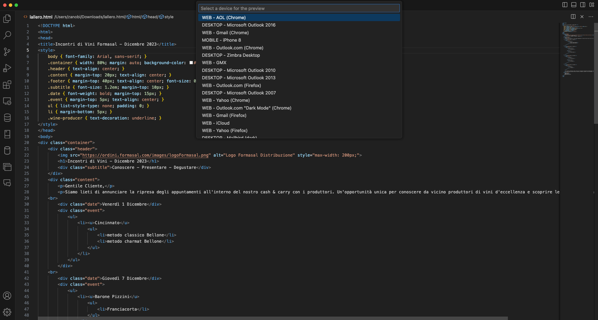
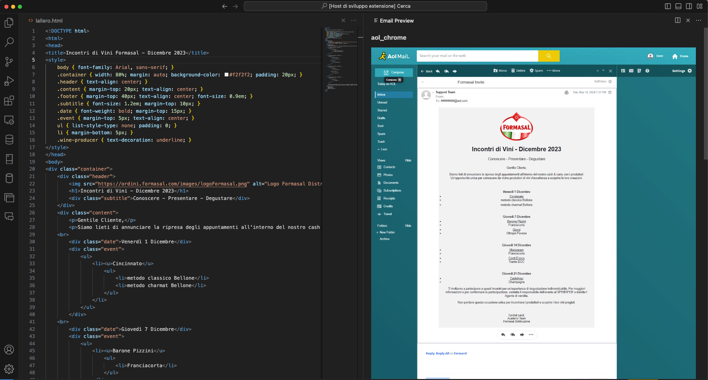

## HTML Email Preview

This API enables developers to preview how HTML emails will render across different email clients and devices. The aim is to eliminate the guesswork and ensure that emails look as intended, no matter where they’re viewed. Additionally, the repository includes a VS Code extension for seamless integration into your development environment. 

Use this tool to streamline your email testing process and maintain consistency and professionalism in your email communications.


### In order to run the commands you need to:

Press CTRL + Shift + P

Choose the command to run

---> Set API Key ( you need to set this first - [ Get one here ](https://emailpreview.h501.io))

---> Show Preview


### Various devices / clients to choose from


### Display the preview directly in VS Code ( [Get the Extension](https://marketplace.visualstudio.com/items?itemName=H501Cloud.html-email-preview) )


You can also use our API to get the preview, is as simple as using cURL

```bash
curl -X GET https://emailpreview.h501.io/devices \
-H "Content-Type: application/json" \
-H "X-API-KEY: 1234567890"

return [{
"name":"AOL Standard",
"category":"WEB",
"deviceKey":"aol_basic"
}]


curl -X POST https://emailpreview.h501.io/sendPreview \
-H "Content-Type: application/json" \
-H "X-API-KEY: 1234567890" \
-d '{"htmlBody":"<h2>Your HTML goes here</h2>","emailSubject":"Some cool stuff","devices":["microsoft_outlook_2016"]}'

return [{
"deviceKey":"aol_basic",
"newImageUrl":"https://emailpreview.h501.io/files/qj123zxxzkj342f.jpg"
}]
```

Note: You could theoretically send more than one device at once, this is supported but it is possible the request will timeout. Work in progress for this. I suggest to choose one device at time until I get it right.

## FAQ

### Are the generated preview just an HTML rendering or is actual device/client simulation?
The preview is a full render simulation of how the HTML code would look like across different devices/simulation. The fidelty is 100% becuase every preview is actually rendered on the desired device/client.

### What devices/clients are supported?
You can find the complete list of devices/clients [here](https://github.com/NeverVane/html-email-preview/blob/master/devices-list.txt)

## Requirements

You need to get an API key at https://emailpreview.h501.io/

## Coming soon

Possibility to run multiple preview at once from the VS Code extension 

## Release Notes

### 1.0.0

Initial release of HTML Email Preview

---

**Enjoy!**
